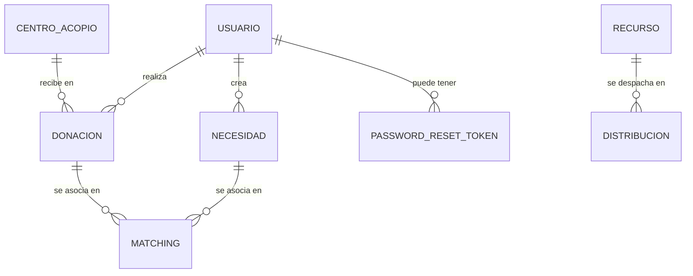

# Reporte de Persistencia de Datos — Sistema Donatón

Este documento describe en detalle la capa de persistencia del proyecto **Donatón**, analizando las 9 entidades JPA, los 8 repositorios compartidos en la librería base (`ms-common`) y la estrategia de conexión e integración modular de base de datos compartida (Shared Database) por PostgreSQL.

---

## 1. Arquitectura de Datos Compartida

El sistema Donatón implementa un patrón de **Base de Datos Compartida (Shared Database Pattern)**. Aunque los microservicios se ejecutan en contenedores independientes y desacoplados a nivel de lógica, todos heredan su estructura de datos y repositorios del componente **`ms-common`** (Shared Kernel).



### Ventajas de este Enfoque
- **Integridad Referencial:** Al compartir el esquema de base de datos PostgreSQL, se garantizan relaciones duras (`@ManyToOne`, `@OneToMany`) y restricciones de clave foránea nativas.
- **Evita Duplicidad de Modelos:** Los cambios en las columnas o validaciones de una entidad en `ms-common` se propagan automáticamente a todos los microservicios al compilar.
- **Rendimiento de Transacciones:** Reduce la necesidad de llamadas REST sincrónicas inter-servicio o patrones complejos como Saga/Outbox para operaciones de consulta simples.

---

## 2. Inventario de Entidades JPA y Modelos de Datos

El sistema consta de **9 entidades principales** mapeadas con Hibernate/JPA:

### 1. `Usuario` (ms-common)
- **Propósito:** Representa a cualquier usuario registrado (Donante, Organización, Administrador o Personal de Logística).
- **Campos Clave:** `id`, `email` (único, indexado), `password` (encriptado con BCrypt), `nombre`, `rol` (Enum: `DONANTE`, `ORGANIZACION`, `ADMIN`, `LOGISTICA`).

### 2. `PasswordResetToken` (ms-common)
- **Propósito:** Almacena tokens temporales UUID para el flujo de restablecimiento de contraseña.
- **Relaciones:** `@OneToOne` con la entidad `Usuario`.
- **Campos Clave:** `id`, `token`, `expiryDate`.

### 3. `Donacion` (ms-common)
- **Propósito:** Registra una donación física ofrecida por un donante.
- **Relaciones:**
  - `@ManyToOne` con `Usuario` (el donante).
  - `@ManyToOne` con `CentroAcopio` (bodega asignada).
- **Campos Clave:** `id`, `descripcion`, `cantidad`, `unidad`, `categoria`, `estado` (Enum: `PENDIENTE`, `EN_PROCESO`, `ENTREGADA`, `CANCELADA`), `fechaCreacion`.

### 4. `Necesidad` (ms-common)
- **Propósito:** Requerimientos publicados por organizaciones de ayuda.
- **Relaciones:** `@ManyToOne` con `Usuario` (la organización beneficiaria).
- **Campos Clave:** `id`, `descripcion`, `cantidadRequerida`, `unidad`, `categoria`, `urgencia` (Enum: `ALTA`, `MEDIA`, `BAJA`), `estado` (Enum: `ACTIVA`, `COMPLETADA`, `INACTIVA`).

### 5. `CentroAcopio` (ms-common)
- **Propósito:** Puntos físicos de almacenamiento donde se reciben e inventarian las donaciones.
- **Campos Clave:** `id`, `nombre`, `direccion`, `ciudad`, `telefono`, `activo` (boolean).

### 6. `Recurso` (ms-common)
- **Propósito:** El inventario físico disponible en los centros de acopio consolidado para su distribución.
- **Campos Clave:** `id`, `nombre`, `tipo` (MEDICAMENTO, ROPA, ALIMENTO, etc.), `cantidad`, `unidad`, `ubicacion`.

### 7. `Distribucion` (ms-common)
- **Propósito:** Despachos o traslados de insumos a puntos de destino/albergues.
- **Relaciones:** `@ManyToOne` con `Recurso` (el ítem del inventario consumido).
- **Campos Clave:** `id`, `cantidad`, `unidad`, `destino`, `zona`, `estado` (EN_TRANSITO, ENTREGADO).

### 8. `Matching` (ms-common)
- **Propósito:** Vinculación algorítmica entre una Donación particular y una Necesidad específica.
- **Relaciones:**
  - `@ManyToOne` con `Donacion`.
  - `@ManyToOne` con `Necesidad`.
- **Campos Clave:** `id`, `estado` (PENDIENTE, APROBADO, RECHAZADO), `score`, `estrategia`.

### 9. `Notificacion` (ms-common)
- **Propósito:** Mensajería y alertas generadas para los usuarios en el sistema.
- **Relaciones:** `@ManyToOne` con `Usuario` (el destinatario).
- **Campos Clave:** `id`, `tipo` (BIENVENIDA, ALERTA_MATCH), `titulo`, `mensaje`, `leida` (boolean), `fechaCreacion`.

---

## 3. Catálogo de Repositorios Compartidos

Los microservicios importan e instancian los siguientes **8 repositorios base** heredados de `ms-common`:

| Repositorio | Entidad Asociada | Métodos Personalizados |
|---|---|---|
| `UsuarioRepository` | `Usuario` | `findByEmail(String)`, `existsByEmail(String)` |
| `DonacionRepository` | `Donacion` | `findByDonanteId(Long)`, `findByEstado(EstadoDonacion)` |
| `NecesidadRepository` | `Necesidad` | `findByEstado(EstadoNecesidad)`, `findByBeneficiarioId(Long)` |
| `CentroAcopioRepository` | `CentroAcopio` | `findByActivoTrue()` |
| `RecursoRepository` | `Recurso` | Métodos CRUD estándar |
| `DistribucionRepository` | `Distribucion` | Métodos CRUD estándar |
| `MatchingRepository` | `Matching` | `findByEstado(EstadoMatching)` |
| `NotificacionRepository` | `Notificacion` | `findByUsuarioId(Long)`, `findByUsuarioIdAndLeida(Long, boolean)` |

> [!NOTE]
> El repositorio de tokens `PasswordResetTokenRepository` se mantiene dentro del microservicio `ms-auth` para mantener la encapsulación lógica de seguridad aislada del núcleo de logística.

---

## 4. Configuración del Pool de Conexiones

Cada microservicio levanta su propia instancia de **HikariCP** (el pool de conexiones por defecto en Spring Boot) apuntando al servidor centralizado de PostgreSQL.

```properties
spring.datasource.url=jdbc:postgresql://postgres:5432/donaton
spring.datasource.username=root
spring.datasource.password=password
spring.datasource.driver-class-name=org.postgresql.Driver

# Configuración de rendimiento del Pool Hikari
spring.datasource.hikari.maximum-pool-size=10
spring.datasource.hikari.minimum-idle=2
spring.datasource.hikari.idle-timeout=30000
spring.datasource.hikari.max-lifetime=1800000
spring.datasource.hikari.connection-timeout=20000
```

Este esquema desacoplado y gobernado por `ms-common` garantiza una base escalable y consistente para el ecosistema de microservicios de **Donatón**.
